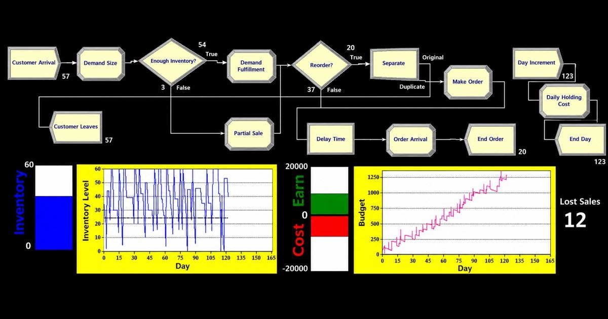
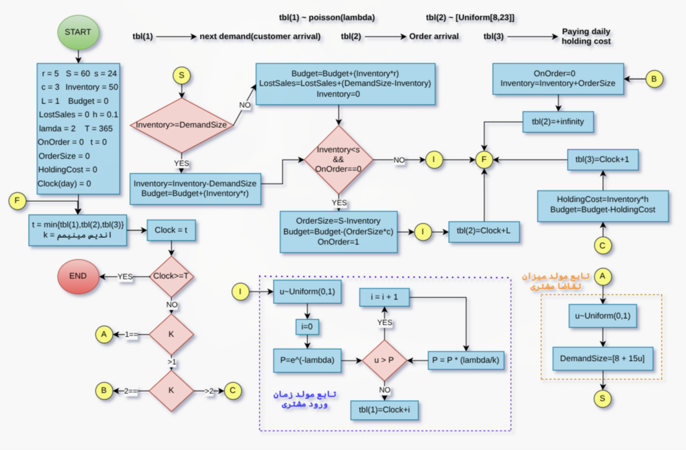
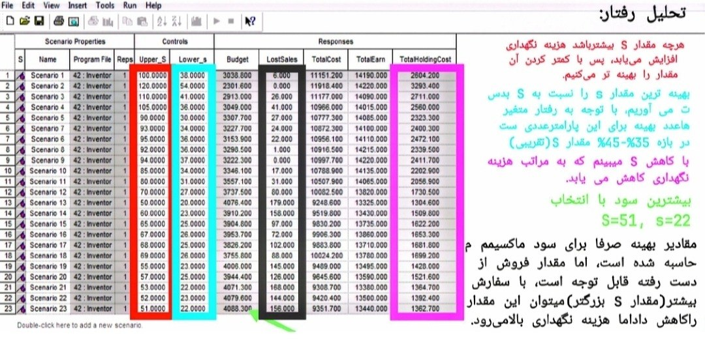
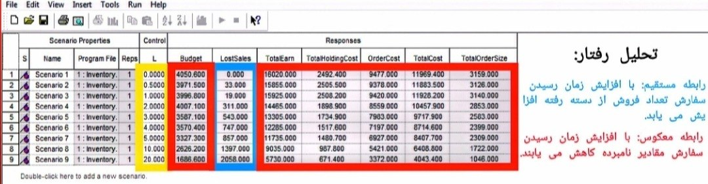

# Inventory Control System Simulation using Arena

> **A Discrete-Event Simulation of an (s, S) Inventory Policy with Parameter Optimization using Rockwell Arena**



---

## Overview

This project presents a **Discrete Event Simulation (DES)** of a single-item inventory control system developed using **Rockwell Arena Simulation**. The objective is to analyze and optimize an **(s, S) inventory replenishment policy** under stochastic customer demand.

The simulation models customer arrivals, random demand sizes, inventory replenishment, supplier lead times, holding costs, ordering costs, lost sales, and revenue generation. Arena's **Process Analyzer (PAN)** is used to perform sensitivity analysis and determine the optimal inventory policy parameters that maximize profit while minimizing total operating cost.

---

## Problem Description

A retail store sells a single product with uncertain customer demand.

Customers arrive according to a stochastic process and request a random number of units. If sufficient inventory exists, the demand is completely satisfied. Otherwise, all available inventory is sold and the remaining demand is recorded as **Lost Sales**.

Whenever the inventory level falls below a predefined reorder point **s**, a replenishment order is automatically placed.

The ordered quantity is:

`OrderSize = S - Inventory`

where

* **Inventory** = Current Inventory
* **s** = Reorder Point
* **S** = Order-up-to Level
* **OrderSize** = amount of order

The order arrives after a supplier lead time **L**.

The simulation evaluates the operational and financial performance of this inventory policy over a one-year planning horizon.

---

# Initial parameters

| Parameter                 | Value            |
| ------------------------- | ---------------- |
| Selling Price (r)         | 5 per unit       |
| Purchase Cost (c)         | 3 per unit       |
| Initial Inventory         | 50 units         |
| Order-up-to Level (S)     | 60 units         |
| Reorder Point (s)         | 24 units         |
| Lead Time (L)             | 1 day            |
| Holding Cost              | 0.1 per unit/day |
| Customer Arrival Rate (λ) | 2 Poisson        |
| Simulation Length (T)     | 365 days         |

# Stochastic Assumptions

### Customer Arrivals (tbl(1))

Customer arrivals follow a **Poisson process**

**Arrival Process:** `N(t) ~ Poisson(λ)` where **Arrival Rate:** `λ = 2`

### Demand Size (tbl(2))

Each customer's demand is randomly generated using **Demand Distribution:** `[Uniform[8, 23]]`

note that it's a <<discrete>> uniform distribution on integers from 8 to 23.

# Flowchart



---

# Event Scheduling Logic

The simulation operates using the Event Scheduling approach.

The primary events are:

1. Customer Arrival
2. Demand Generation
3. Inventory Availability Check
4. Complete Sale
5. Partial Sale
6. Lost Sale
7. Inventory Reorder
8. Order Arrival
9. Daily Holding Cost Calculation
10. End of Simulation

---

# Performance Metrics

The following Key Performance Indicators (KPIs) are collected throughout the simulation.

* Inventory Level
* Total Earn
* Budget
* Holding Cost
* Ordering Cost
* Total Cost
* Lost Sales
* Partial Sales
* Number of Orders
* Order Size
* Profit

---

# Simulation Dashboard (system monitoring)

The simulation includes an interactive dashboard displaying:

* Real-time inventory level
* Inventory history
* Budget trend
* Cost vs. Revenue
* Lost sales counter

This visualization enables immediate monitoring of system behavior during execution.

---

# Process Analyzer Experiments

Arena Process Analyzer was used to perform sensitivity analysis on the inventory policy.

The following parameters were varied:

* Reorder Point (s)
* Order-up-to Level (S)
* Supplier Lead Time (L)

For each scenario, the following outputs were evaluated:

* Total Revenue
* Total Cost
* Budget
* Lost Sales
* Holding Cost
* Ordering Cost

---

# Optimization Results

## Effect of Order-up-to Level (S)

Increasing **S** generally reduced lost sales by maintaining higher inventory availability.

However, excessively large inventory levels significantly increased holding costs.

Simulation results indicated that the best overall performance occurred approximately within

`S ≈ 51`

with

`s ≈ 22`

providing the highest net profit under the modeled assumptions.

---

## Effect of Lead Time

Lead time had a strong influence on system performance.

As lead time increased:

* Lost sales increased.
* Total revenue decreased.
* Total inventory declined.
* Profit decreased.
* Customer service level deteriorated.

Reducing supplier lead time produced substantial improvements in overall inventory performance.

---

# Repository Structure

```text
inventory-control-arena/

│
├── ArenaModel/
│   ├── Inventory.doe
│   ├── Inventory.mdb
│   ├── Inventory.opw
│   └── Inventory.out
│
├── screenshots/
│   ├── arena_model.png
│   ├── dashboard.jpg
│   ├── process_analyzer_S.jpg
│   └── process_analyzer_L.jpg
│
├── docs/
│   ├── Project_Report.pdf
│
│
├── README.md
└── LICENSE
```

---

# Technologies Used

* Rockwell Arena Simulation
* Arena Process Analyzer (PAN)
* Draw.io

---

# Screenshots

| Flowchart                      | Arena Model                      |
| -------------------------------- | ------------------------------ |
|  |  |

| Parameter Optimization                  | Lead Time Analysis                      |
| --------------------------------------- | --------------------------------------- |
|  |  |
